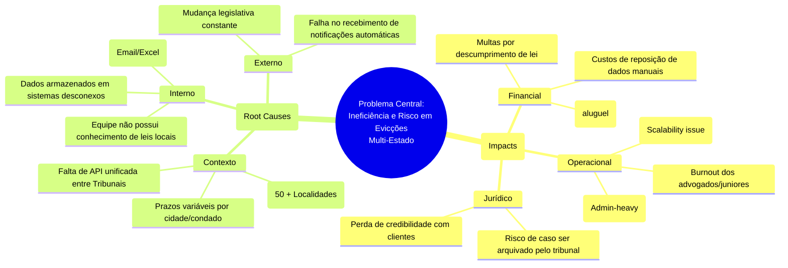

# undefined

Gerado automaticamente pelo workflow analysis.problem-tree.

## Resumo do Resultado
Olá! Sou a Mary, sua Business Analyst.

Recebi o seu input sobre a dor do escritório de advocacia nos EUA. O desafio é claro: **heterogeneidade legislativa (50 estados) + necessidade de tracking rigoroso de prazos = alto risco e ineficiência operacional.**

Abaixo, apresento o conteúdo para o artefato **`docs/problem-tree.md`**, estruturado seguindo o framework de *Problem Tree Analysis* para guiar nosso time de desenvolvimento e produto.

Também incluí um **Plano de Ação Imediato** baseado nesta estrutura.

---

# 📄 Artefato: `docs/problem-tree.md`

```markdown
# Problem Tree: Gestão de Despejo nos EUA
**Autor:** Mary (Business Analyst)  
**Data:** 24 de Maio de 2024  
**Versão:** 1.0  
**Status:** Rascunho / Análise Inicial  

---

## 1. Executive Summary
O objetivo desta análise é desconstruir a complexidade do gerenciamento de processos de despejo (*evictions*) em escritórios de advocacia nos EUA. O problema central reside na impossibilidade de garantir *compliance* e *tracking* preciso devido à fragmentação legislativa estadual, resultando em riscos financeiros e operacionais.

---

## 2. Problema Central (Root)
> **Enunciado do Problema:**
> "Escritórios de advocacia atuando em múltiplos estados dos EUA enfrentam falhas no processo de despejo devido à impossibilidade de adaptar e rastrear rapidamente as legislações estaduais distintas, resultando em erros de prazos, multas e perda de casos."

### Diagrama da Árvore do Problema (Textual/Mermaid)



---

## 3. Decomposição Detalhada

### 3.1. Ramos de Causa (Left Branch - As Origens)
| Nível | Causa Específica | Descrição Detalhada |
| :--- | :--- | :--- |
| **Primária** | **Fragmentação Legislativa** | Cada estado (e muitos condados) possui regras diferentes sobre notificação prévia, audiências e taxas. Um sistema "genérico" falha. |
| **Secundária** | **Silos de Informação** | Dados de casos estão espalhados entre CRM, E-mail, Excel e sistemas de tribunais específicos que não se comunicam. |
| **Terciária** | **Processos Manuais** | Advogados dedicam horas pesquisando códigos estaduais antes de começar a digitar, aumentando o erro humano. |

### 3.2. Ramo de Impacto (Right Branch - As Consequências)
| Nível | Impacto no Negócio | Severidade |
| :--- | :--- | :--- |
| **Crítico** | **Perda Financeira Direta** | Perda do caso (case dismissal) por prazo vencido. Multas judiciais. |
| **Alto** | **Risco Legal e Reputação** | Clientes (proprietários) insatisfeitos por processos travados. Multas regulatórias. |
| **Médio** | **Ineficiência Operacional** | Custo da hora-homem (HH) elevado para gestão de processos de baixa complexidade. |

---

## 4. Métricas Sugeridas (KPIs) para Validação
Para mensurar a melhoria após a implementação da solução, propomos as seguintes métricas:

1.  **Taxa de *Compliance* de Prazos:**
    *   *Definição:* % de processos onde o prazo legal de notificação/audiência foi respeitado.
    *   *Meta Atual:* Estimativa < 85% (devido a erros manuais).
    *   *Meta Pós-Solução:* > 99%.
2.  **Tempo de Rastreabilidade (Tracking Time):**
    *   *Definição:* Tempo gasto por advogado identificando o estado legal atual de um caso.
    *   *Meta:* Redução de 4h/dia para < 15min.
3.  **Custo por Casamento (Cost per Case Initiation):**
    *   *Definição:* Custos operacionais para iniciar um novo processo de despejo.
    *   *Objetivo:* Redução de 30% via automação de pesquisas de leis.
4.  **Taxa de Atualização de Status (Court Update Accuracy):**
    *   *Definição:* % de acuracidade na atualização do status do processo após a decisão do tribunal.

---

## 5. Plano de Ação (Next Steps)

### Fase 1: Descoberta (Discovery) - *Prioridade Alta*
1.  **Mapeamento de Jurisdições:** Identificar os 5-10 estados com maior volume de demanda inicial.
2.  **Entrevistas de Usuários (Legal Ops):** Conversar com Advogados e Assistentes em diferentes estados para validar dores específicas (ex: "No Estado X, o tribunal não envia e-mail, apenas carta").
3.  **Concorrência:** Analisar soluções existentes (ex: LexisNexis, Clio, específicos de *eviction*).

### Fase 2: Solução Técnica (Product/Dev)
1.  **Design System de Leis:** Criar uma estrutura de dados (JSON Schema) capaz de representar regras locais distintas.
2.  **Mecanismo de Alerta Inteligente:** Sistema que consulta a lei específica do município onde a imóvel está, não apenas o estado.
3.  **Integração de API:** Buscar parcerias com tribunais locais ou serviços de notificação (e.g., Process Servers) para validação de dados.

### Fase 3: Validação e MVP
1.  **MVP Piloto:** Implementar para 2 escritórios em estados diferentes (ex: New York e Texas) para testar a lógica heterogênea.
2.  **Feedback Loop:** Monitorar se o sistema alertou corretamente sobre mudanças de lei antes da implementação.

---

## 6. Decisões e Precedentes
*   **Precedência:** Não construir um CRUD genérico. O produto deve ser construído em torno do *Jurisdictional Engine* (Motor de Jurisdição).
*   **Scope Inicial:** Focar em *Eviction Notices* (Notificações de Despejo) e audiências pré-audiência. Evitar outras áreas de direito imobiliário nesta fase para não diluir o MVP.

---
**Próximas Ações:** Agendar reunião técnica para definir a arquitetura do *Jurisdictional Engine* e validar lista de jurisdições alvo.
```

---

# 📋 Plano Estruturado para o Time (Resumo)

Como BA, aqui estão as minhas recomendações para a liderança e o squad agora:

### 1. Entendimento do Problema
O problema não é apenas um "CRM", é um problema de **Dados Legais + Compliance**. Se tentarmos criar um sistema que tenta ser tudo (processo civil, família, criminal), falharemos no escopo de *evictions*.

### 2. Artefatos para Gerar
*   **Mapeamento de Leis:** Precisamos de uma lista inicial de estados alvo (ex: Califórnia, Flórida, Texas) para mapear a estrutura de datas de cada tribunal.
*   **User Stories:** Criar histórias focadas em "Validação de Prazo", não apenas em "Lançar Caso".

### 3. Ações Imediatas
1.  **Entrevista Rápida:** Perguntar aos leads de vendas: "Quais estados os escritórios compradores querem atender primeiro?" (Isso define nosso MVP).
2.  **Validação de Parceiros:** Investigar se podemos integrar com serviços de *Process Serving* para validar automaticamente o recebimento do despejo.
3.  **Definição de Escopo:** Cortar funcionalidades não relacionadas a "Evidência" para focar na automação de compliance.

### 4. O Que Preciso de Vocês?
*   **Dev:** Avaliação da arquitetura para suportar lógica condicional complexa baseada em geolocalização.
*   **Produto:** Priorização das regras de negócio de cada estado na back-log.

Pronto para avançar com o detalhamento do MVP se esta árvore de problemas estiver correta! Vamos ajustar se houver algum detalhe que eu perdi.

## Próximos Passos
- Revisar com o time responsável e coletar comentários.
- Validar se os itens de "Inputs esperados" estão atualizados antes do próximo workflow.